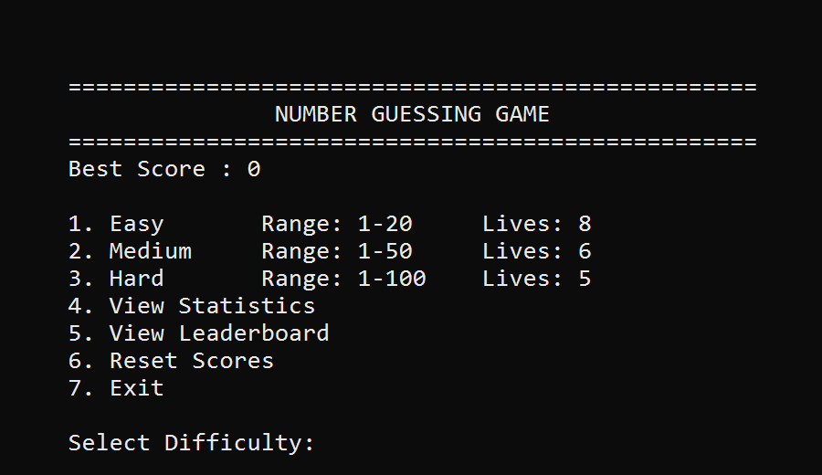
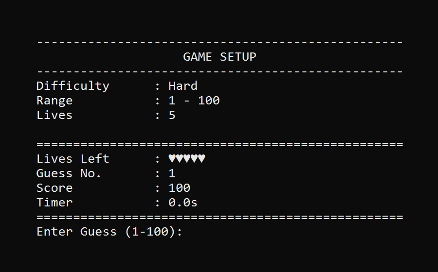
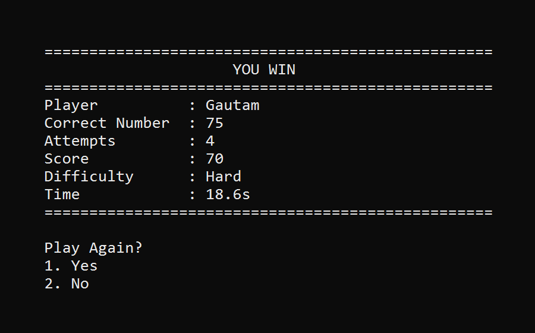
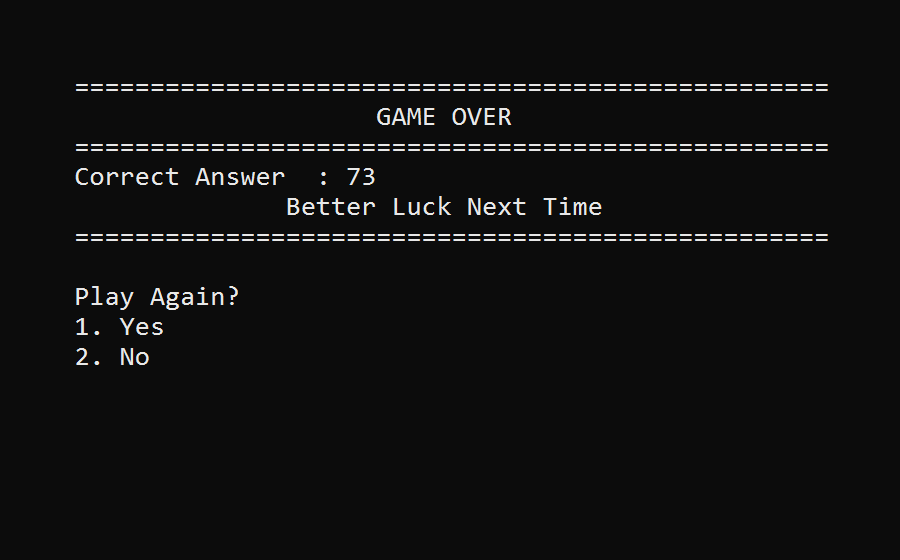
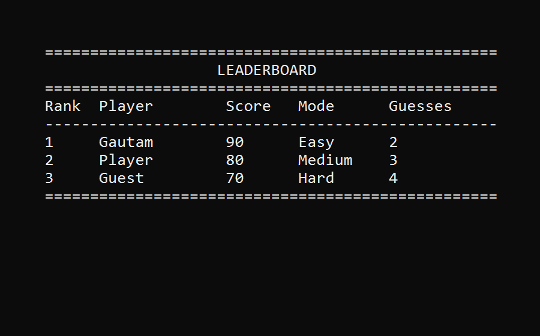
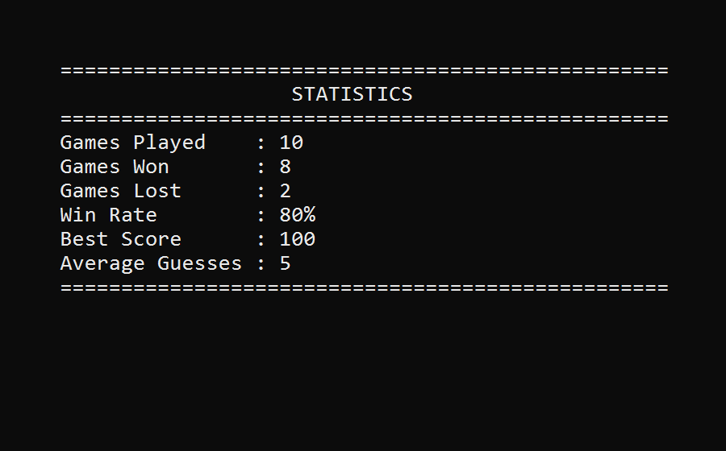

# Number Guessing Game

A portfolio-ready Python CLI Number Guessing Game featuring multiple difficulty
levels, smart hints, score tracking, leaderboard, persistent statistics, and
optional Windows sound effects.

**Current Version:** 1.0.0

## Screenshots

### Main Menu



### Difficulty Selection



### Winning Screen



### Losing Screen



### Leaderboard



### Statistics



## Features

- Welcome screen
- Player name input
- Difficulty selection: Easy, Medium, Hard
- Random number generation
- Limited lives
- Guess counter
- Score system
- Smart hints
- Guess history
- Play again option
- Leaderboard
- Reset scores option
- Best score saved in JSON
- Game statistics saved in JSON
- JSON persistence
- Optional Windows terminal sound effects

## Installation

```bash
git clone https://github.com/GautamSharma-DS/Python_Number_Guessing_Game.git
cd Python_Number_Guessing_Game
python -m venv guess_venv
```

Windows:

```bash
guess_venv\Scripts\activate
pip install -r requirements.txt
```

## Run

```bash
python -m src.main
```

or

```bash
python src/main.py
```

## Project Structure

```text
Python_Number_Guessing_Game/
|
|-- src/
|-- data/
|-- tests/
|-- docs/
|-- assets/
|-- README.md
|-- CHANGELOG.md
|-- CONTRIBUTING.md
|-- LICENSE
|-- requirements.txt
```

## Difficulty

| Difficulty |  Range  | Lives |
| ---------- | ------- | ----- |
| Easy       | 1 - 20  |   8   |
| Medium     | 1 - 50  |   6   |
| Hard       | 1 - 100 |   5   |

## Score Rules

- Maximum score: 100
- Start with 100 points
- Every wrong guess subtracts 10 points
- Score never goes below 0

## Hint Examples

If the correct number is `75`:

- Guess `73` shows `Very Close!`
- Guess `68` shows `Too Low`
- Guess `40` shows `Much Lower`
- Guess `82` shows `Too High`
- Guess `95` shows `Much Higher`

## Menu

```text
1. Easy
2. Medium
3. Hard
4. View Statistics
5. View Leaderboard
6. Reset Scores
7. Exit
```

## Sample Game Status

```text
============================================
Lives Left : ♥♥♥♡♡
Guess No.  : 3
Score      : 80
Timer      : 12.4s
Previous   : 40, 95
============================================
```

## Data Files

- `data/scores.json` stores top winning scores and player names
- `data/stats.json` stores overall statistics

## Tests

```bash
python -m unittest discover tests
```

## License

This project is licensed under the MIT License.
